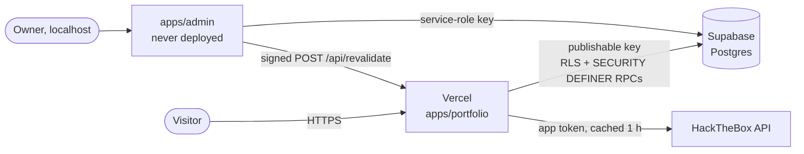

# Architecture

## System context



The public site holds only the publishable key; everything it can do is bounded
by row-level security and two validating RPCs (`track_event`,
`submit_contact_message`). The privileged key exists only on the owner's machine
([ADR 0003](adr/0003-privileged-key-confined-to-local-admin.md)).

## Workspace graph

```mermaid
flowchart TD
  portfolio[apps/portfolio] --> ui & data & security & config & types & supabase & tw[tailwind-config]
  portfolio -.dev.-> checks[tooling/checks]
  admin[apps/admin] --> ui & data & security & config & types & supabase & tw
  data[@repo/data] --> supabase[@repo/supabase] & config & types
  supabase --> config[@repo/config] & types[@repo/types]
  security[@repo/security] --> config
  config --> types
```

Rules, enforced in CI by the `boundaries` job in `.github/workflows/ci.yml`:

1. `apps/portfolio` never imports `@repo/supabase/admin` or `@repo/data/admin`.
2. Nothing under `packages/` imports from `apps/`.
3. Every workspace a file imports is declared in that workspace's `package.json`
   (no phantom dependencies via hoisting).

## Packages

| Package                                                    | Responsibility                                          |
| ---------------------------------------------------------- | ------------------------------------------------------- |
| [`@repo/config`](../packages/config)                       | Validated env (public + server), site constants         |
| [`@repo/security`](../packages/security)                   | CSP, proxy primitives, crypto, rate limiting, audit log |
| [`@repo/data`](../packages/data)                           | Every database read/write, Zod schemas, HackTheBox      |
| [`@repo/supabase`](../packages/supabase)                   | Typed client construction — nothing else                |
| [`@repo/types`](../packages/types)                         | Database types and domain projections                   |
| [`@repo/ui`](../packages/ui)                               | Shared React components                                 |
| [`@repo/tailwind-config`](../packages/tailwind-config)     | Design tokens and base CSS                              |
| [`@repo/eslint-config`](../packages/eslint-config)         | Flat ESLint configs                                     |
| [`@repo/typescript-config`](../packages/typescript-config) | Shared `tsconfig` bases                                 |
| [`@repo/checks`](../tooling/checks)                        | Operational CLIs: headers, SEO, Supabase diagnostics    |

Packages are consumed as TypeScript source, not built
([ADR 0007](adr/0007-source-consumed-internal-packages.md)).

## Request lifecycle (public site)

1. **`proxy.ts`** — `screenRequest()` rejects disallowed methods (405), known
   scanner probes (404) and malformed requests (400). `secureNext()` mints a
   per-request nonce, sets the CSP on request and response, and applies the
   header set from `@repo/security/headers`.
2. **Root layout** awaits `headers()` to read the nonce, which makes the render
   dynamic ([ADR 0002](adr/0002-nonce-csp-with-dynamic-rendering.md)).
3. **Data** comes from `@repo/data/content`, wrapped in `unstable_cache`
   (1 h, tag-invalidated). Degraded results are not cached
   ([ADR 0005](adr/0005-fail-soft-data-layer.md)).
4. **Writes** from visitors (contact form, analytics beacon) go through
   rate-limited Server Actions / route handlers into validating RPCs.

## Build and task graph

Turborepo runs `lint`, `type-check` and `test` with no upstream dependencies, so
every workspace runs in parallel. Only `build` depends on `^build`.
Environment variables are split three ways in `turbo.json`:

| Key                               | Meaning                                                       |
| --------------------------------- | ------------------------------------------------------------- |
| `globalEnv`                       | Inlined into bundles → part of the cache key                  |
| `globalPassThroughEnv`            | Runtime secrets → available to tasks, never hashed            |
| `apps/admin/turbo.json` overrides | Admin-only secrets, so they never reach the portfolio's tasks |

## CI/CD

| Workflow       | Trigger          | Jobs                                                                   |
| -------------- | ---------------- | ---------------------------------------------------------------------- |
| `ci.yml`       | push, PR         | quality, workflow lint, test + coverage, boundaries, build, smoke      |
| `security.yml` | push, PR, weekly | npm audit, signatures, SBOM, dependency review, gitleaks, secret scans |
| `codeql.yml`   | push, PR, weekly | CodeQL `security-extended`                                             |
| `pr-title.yml` | PR               | Conventional Commit title                                              |

All third-party actions are pinned to a commit SHA; Dependabot bumps them.
There is no deploy workflow — see [ADR 0004](adr/0004-sst-local-state-vercel.md).
